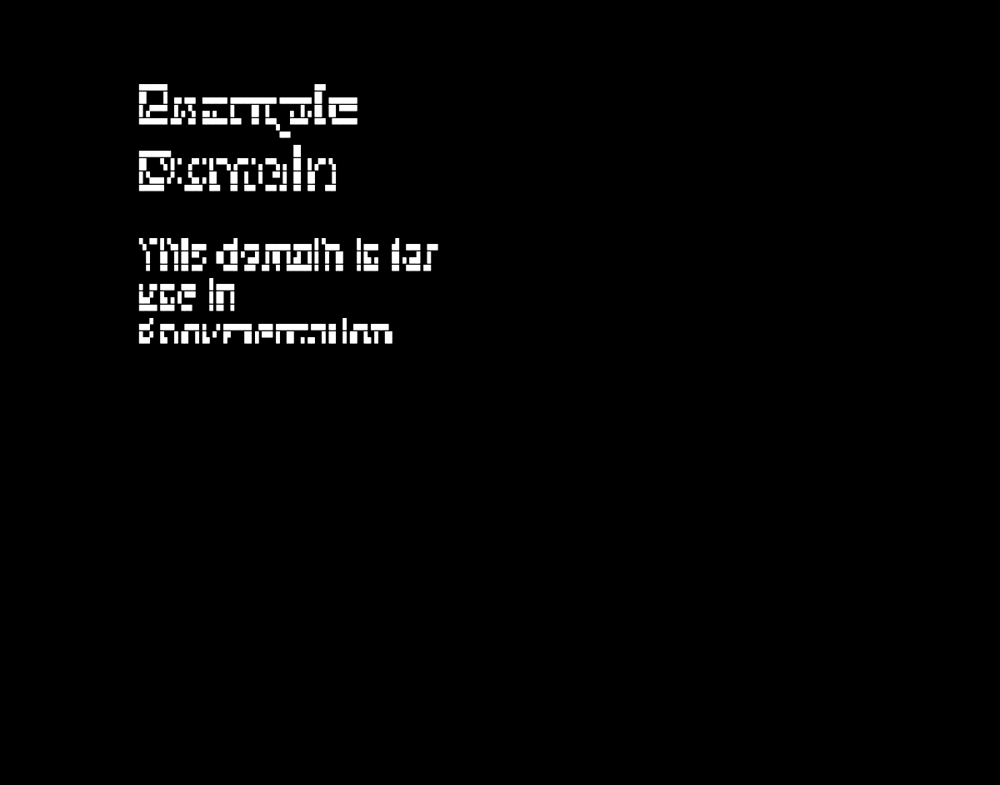

# TermGlide

> The graphical web, inside your terminal.

[](https://github.com/DAWNCR0W/TermGlide/actions/workflows/ci.yml)
[](https://github.com/DAWNCR0W/TermGlide/releases/latest)
[](https://www.rust-lang.org)
[](#license)

TermGlide runs a local Chrome or Chromium process, controls it over the loopback Chrome DevTools
Protocol (CDP), and projects the rendered page into terminal cells. Version 1.0 intentionally has
one browser engine and one lifecycle: every session uses an isolated temporary browser profile
that is removed when the session ends.



_TermGlide 1.0 running in Terminal.app with the quadrant renderer and an isolated Chrome session._

## Included in 1.0

- Interactive browsing with keyboard, mouse, scrolling, reload, zoom, and an address bar.
- `cells`, `halfblock`, `quadrant`, and `braille` terminal renderers with automatic selection.
- Deterministic `doctor`, `inspect`, `snapshot`, and `dump` commands for automation.
- DOM and accessibility-tree dumps through CDP.
- Optional proxy, proxy-bypass, user-agent, image, JavaScript, viewport, scale, and data-limit
  controls.

TermGlide does not include a separate Rust-native web engine, persistent Chrome profiles, browser
extensions, credential import, synchronization, or a remote-browser mode.

## Requirements

- Rust `1.92.0` for source builds.
- A local Google Chrome, Chromium, or compatible Chromium executable.
- An xterm-compatible TTY for interactive mode.

Run the environment check first:

```console
cargo run --locked -p termglide -- doctor
```

Use `--browser-executable /absolute/path/to/chrome` if automatic discovery cannot find the browser.

## Build and run

Prebuilt binaries for Linux, macOS, and Windows are published with each GitHub release; download
the archive for your platform, extract it, and add `termglide` to your `PATH`. Or build from source:

```console
cargo build --locked --release -p termglide
./target/release/termglide doctor
./target/release/termglide https://example.com
./target/release/termglide "terminal browser projects"
```

Interactive controls are shown in the status bar:

- `g`: open the address bar
- `+` / `-`: zoom in or out
- `l`: reload
- `Tab` / `Enter`: move focus and activate
- arrow keys / `Page Up` / `Page Down`: scroll
- `Ctrl-C`: quit

Automation examples:

```console
termglide inspect https://example.com
termglide dump --format dom https://example.com
termglide dump --format accessibility https://example.com
termglide snapshot --format ansi --output page.ansi https://example.com
```

Run `termglide --help` for the complete CLI contract.

## Configuration

`termglide doctor` prints the active default configuration path. Pass `--config PATH` to use an
explicit TOML file. Unknown fields are rejected.

```toml
version = 1

[browser]
homepage = "about:newtab"
default_search = "https://duckduckgo.com/?q={query}"

[render]
backend = "auto"

[network]
proxy = ""
no_proxy = []
data_limit_bytes = 0

[javascript]
enabled = true
```

Architecture and testing details live in [docs/architecture.md](docs/architecture.md) and
[docs/testing.md](docs/testing.md).

## Security

TermGlide treats the browser process, CDP endpoint, terminal state, and temporary profile as
security boundaries. Report vulnerabilities privately as described in [SECURITY.md](SECURITY.md).

## Contributing

Contributions are welcome. Start with [CONTRIBUTING.md](CONTRIBUTING.md) for the branch workflow,
project boundaries, and required validation. Regular pull requests target `develop`; `main` is
reserved for releases promoted from `develop`.

## Support

If TermGlide is useful to you, you can support its continued development on
[Ko-fi](https://ko-fi.com/dawncr0w). Bug reports, code contributions, and thoughtful feedback are
equally appreciated.

## License

TermGlide is licensed under [Apache-2.0](LICENSE-APACHE) or [MIT](LICENSE-MIT), at your option.
